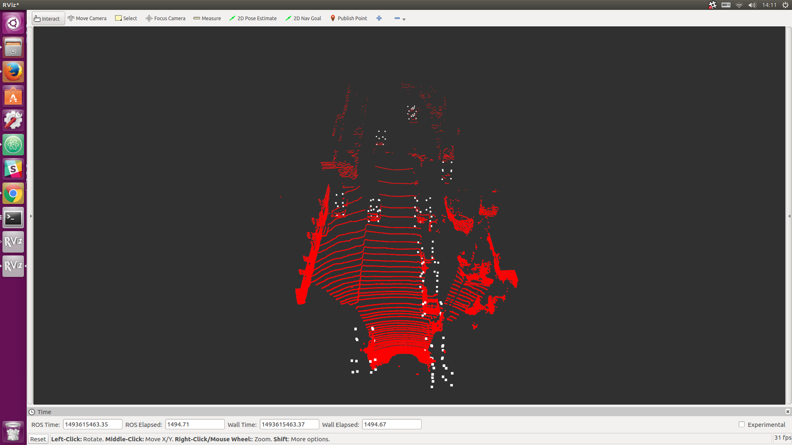
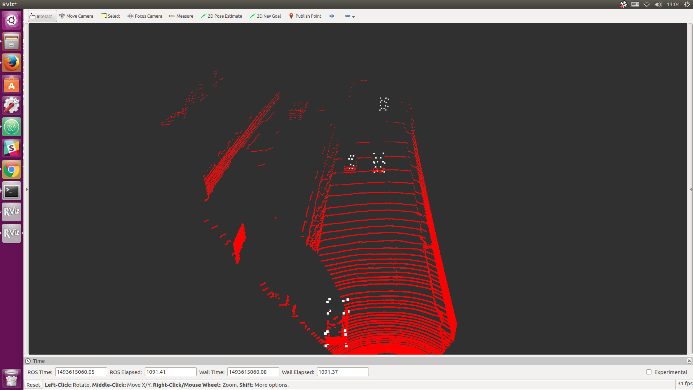

# KiTTI Data Processing and 3D CNN for Vehicle Detection
## 3D CNN for Vehicle Detection
<b>3D Fully Convolutional Network using PointCloud data for Vehicle Detection<b>  
Reference: <b>3D Fully Convolutional Network for Vehicle Detection in Point Cloud<b> 
<https://arxiv.org/pdf/1611.08069.pdf>  

Main File is "model_01_deconv.py"  
Data Loading Function is "input_velodyne.py"  

### Example (3D Bounding Box:8 Vertices) Not executing NMS
  
  

## Requirement
- Python
- tensorflow
- ROS
- Python-PCL (If you will not use pcl, please comment out related code in input_velodyne.py

## KiTTI Data Processing
<b>Dataset is KITTI 3D Object Detection Datasets<b>  
<http://www.cvlibs.net/datasets/kitti/eval_object.php?obj_benchmark=3d>
- Velodyne PointCloud
- training labels
- Calibration
